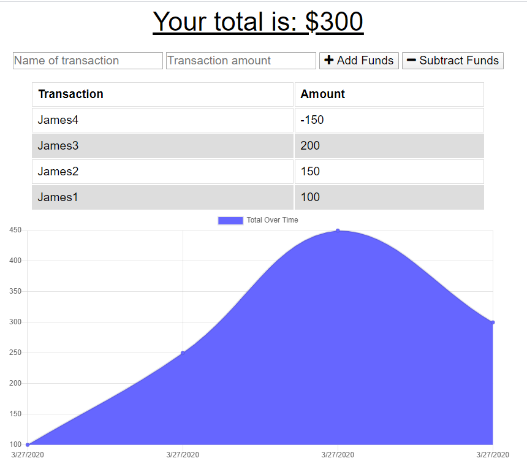
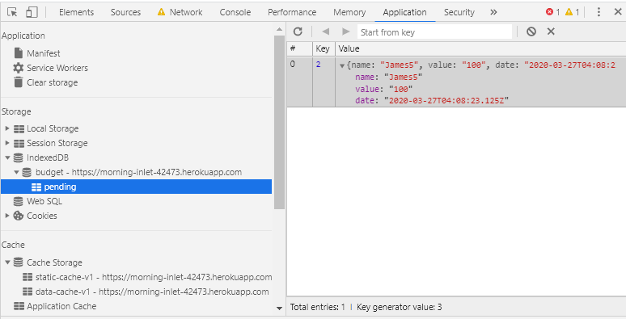

# Budget Trackers

An application to track budget which allows the user to enter deposits and expenses even when the user is offline. When transactions entered offline, the application will populate data and calculate the total when user goes online. This application uses Node, Express, Mongoose and uses webmanifest and service-worker


Offline Functionality:

  * Enter deposits offline

  * Enter expenses offline

When brought back online:

  * Offline entries added to tracker.

## User Story

AS AN avid traveller
I WANT to be able to track my withdrawals and deposits with or without a data/internet connection
SO THAT my account balance is accurate when I am traveling

## Business Context

Giving users a fast and easy way to track their money is important, but allowing them to access that information anytime is even more important. Having offline functionality is paramount to our applications success.

-  Github
> https://github.com/JameskuttySebastian/ASSIGNMENT18_BudgetTrackers

-  Heroku
> https://morning-inlet-42473.herokuapp.com/

## Technologies used

- HTML
- CSS
- Node
- Express
- Mongoose

## Home page



This page is for adding and viewing withdrawals and deposits

### Indexed DB



This shows the saved offline transaction

### Prerequisites

It needs node to run the application.

### Installing

After forking the repository, clone repository to local machine.

Run the following command in the root directory to install the dependencies.

```
npm install
```

And run following command in the root directory, the application will open in default browser.

```
npm start
```

## Running the tests

There are no automated tests for this application

## Deployment

Follow Heroku CLI (or specific to the deployment platform) standard deployment method to deploy the application.


## Versioning

We use [Git](https://git-scm.com/) for versioning.
